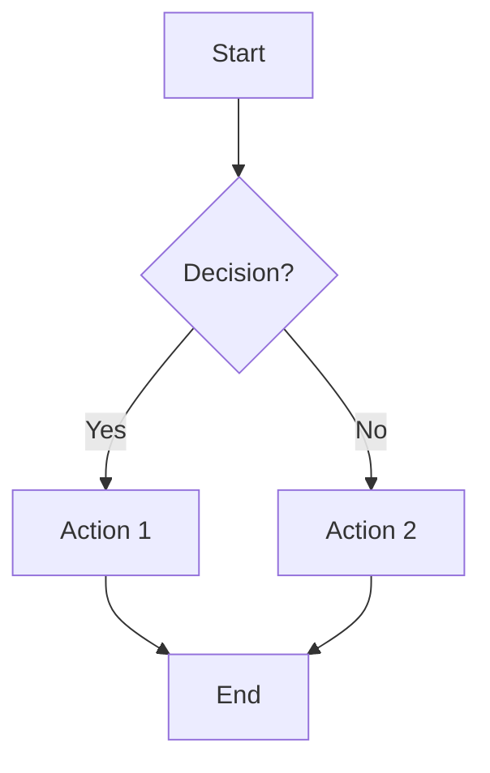
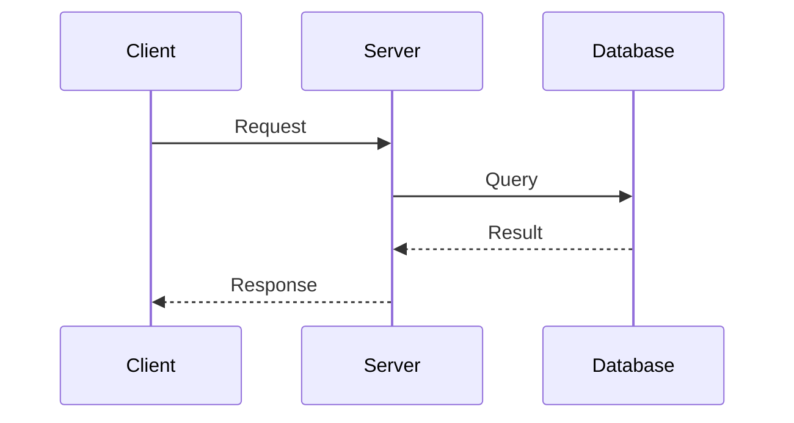
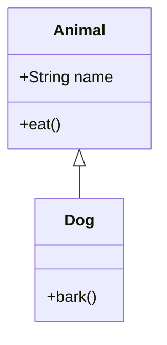
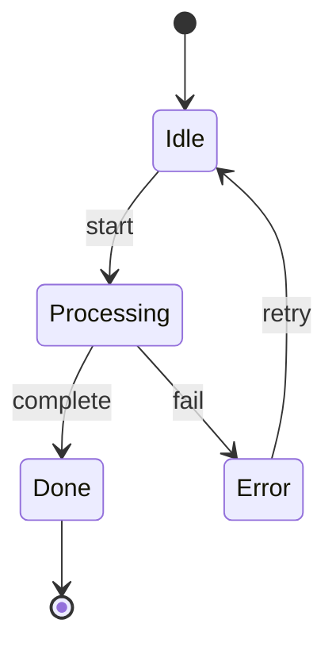
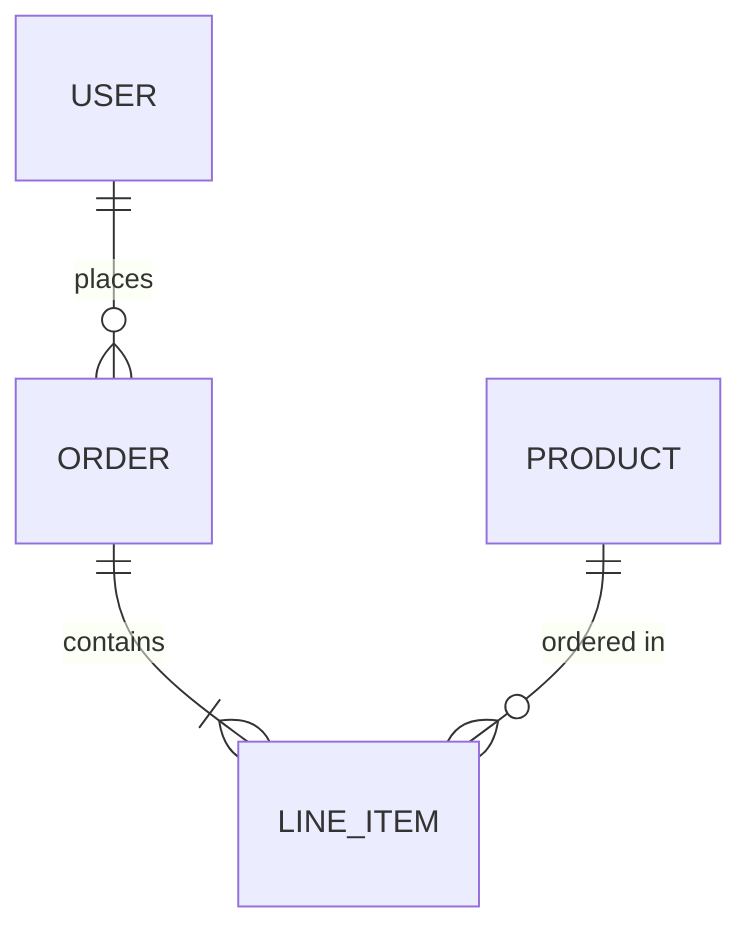

# mermaid-diagram

Creates syntactically correct Mermaid diagrams following official specifications and preventing common errors.

## Triggers

- "flowchart", "diagram", "mermaid"
- "workflow diagram", "sequence diagram", "class diagram"
- "시각화", "다이어그램", "플로우차트"
- When documenting architecture, processes, or data flows

## Supported Diagram Types

| Type | Use Case |
|------|----------|
| `flowchart` | Process flows, decision trees |
| `sequenceDiagram` | API calls, interactions |
| `classDiagram` | OOP structures, relationships |
| `stateDiagram` | State machines, lifecycles |
| `erDiagram` | Database schemas |
| `gantt` | Project timelines |
| `mindmap` | Brainstorming, hierarchies |

## Critical Rules

### 1. Special Characters - ALWAYS Quote
```mermaid
%% BAD - breaks syntax
A[User:Admin] --> B

%% GOOD - quoted label
A["User:Admin"] --> B
```

Problematic characters: `:`, `()`, `[]`, `{}`, `@`, `;`, `,`

### 2. Reserved Word "end"
```mermaid
%% BAD - lowercase breaks syntax
A --> end

%% GOOD - capitalize
A --> End
```

### 3. Subgraph Syntax
```mermaid
%% BAD
subgraph "My Group"

%% GOOD - ID required
subgraph myGroup["My Group"]
```

### 4. Note Usage
- `note` is ONLY valid in `sequenceDiagram`
- For flowchart annotations, use styled nodes instead

### 5. classDiagram - Define Before Link
```mermaid
%% BAD
A --> B
class A { }

%% GOOD
class A { }
class B { }
A --> B
```

## Quick Start Templates

### Flowchart


### Sequence Diagram


### Class Diagram


### State Diagram


### ER Diagram


## Workflow

```
1. Identify diagram type based on content
2. Start with minimal structure
3. Add complexity incrementally
4. Validate syntax before finalizing
5. Test rendering if possible
```

## Validation Checklist

Before completing:
- [ ] All labels with special chars are quoted
- [ ] No lowercase "end" as node name
- [ ] Subgraphs have ID before title
- [ ] Notes only in sequenceDiagram
- [ ] Classes defined before relationships
- [ ] Arrow syntax matches diagram type

## Common Errors & Solutions

| Error | Cause | Fix |
|-------|-------|-----|
| Parse error at ":" | Unquoted special char | `["Label:Value"]` |
| Unexpected "end" | Reserved word | Use `End` or `END` |
| Subgraph not rendering | Missing ID | `subgraph id["Title"]` |
| Note syntax error | Wrong diagram type | Only use in sequenceDiagram |

## Best Practices

1. **Keep Simple**: Start minimal, add complexity gradually
2. **Test Incrementally**: Validate after each major addition
3. **Use Consistent Style**: Pick a direction (TD/LR) and stick to it
4. **Meaningful IDs**: Use descriptive node IDs for maintainability
5. **Comment Complex Parts**: Use `%%` for inline comments
